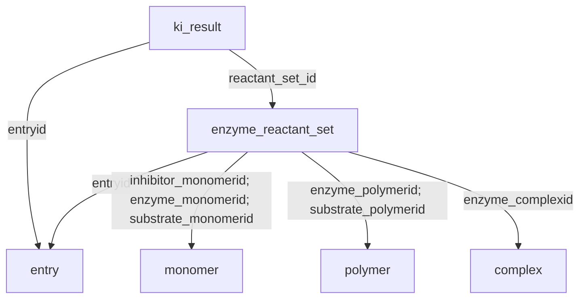

# BindingDB October 2026 MySQL schema

Extracted directly from `BDB-mySQL_All_202610.dmp` in the supplied archive on October 2, 2026. No database records are included in these deliverables.

Source: https://www.bindingdb.org/rwd/bind/BDB-mySQL_All_202610_dmp.zip

The archive contains the SQL dump (2,178,177,747 bytes) and `INSTALL_mysql`. The dump reports MySQL 8.4.9; installation notes report testing with 8.4.7. All 32 tables use InnoDB, utf8mb4, and utf8mb4_0900_ai_ci.

## Core structure

A measurement in `ki_result` references an `enzyme_reactant_set` and a deposited `entry`. Reactant sets identify the target/enzyme, inhibitor, and substrate. Small molecules are represented in `monomer`, macromolecules in `polymer`, and molecular complexes in `complex`. Publications are reached through `entry_citation` and `article`.

The arrows above represent declared foreign keys. Additional inferred links are listed separately below.

## Table inventory

| Table | Primary key | Columns | Purpose |
|---|---|---:|---|
| `art_aut` | `articleid`,`authorid` | 6 | Article authors and author order. |
| `article` | `articleid` | 12 | Publications, PMID, DOI, title, and bibliographic metadata. |
| `article_kword` | `articleid`,`kword` | 2 | Article keywords. |
| `assay` | `entryid`,`assayid` | 4 | Assay names and descriptions within entries. |
| `cobweb_bdb` | `target_name`,`monomer_id`,`source_organism`,`affinity_type` | 9 | Denormalized target–inhibitor affinity summary. |
| `complex` | `complexid` | 9 | Molecular complexes, display names, and external identifiers. |
| `complex_component` | `complexid`,`componentid` | 5 | Components of complexes, referring to polymers or monomers. |
| `complex_name` | `complexid`,`name` | 2 | Alternative complex names. |
| `data_fit_meth` | `data_fit_meth_id` | 5 | Data fitting methods and software. |
| `entry` | `entryid` | 10 | Deposited records and measurement technique. |
| `entry_citation` | `articleid`,`entryid`,`art_purp` | 3 | Links entries to publications with citation purpose. |
| `entry_kword` | `entryid`,`kword` | 2 | Entry keywords. |
| `enzyme_reactant_set` | `reactant_set_id` | 20 | Target/enzyme, inhibitor, and substrate identities for a reactant set. |
| `instrument` | `instrumentid` | 7 | Measurement instruments. |
| `itc_result_a_b_ab` | `entryid`,`itc_result_a_b_ab_id` | 46 | Isothermal titration calorimetry results and thermodynamic parameters. |
| `itc_run_a_b_ab` | `entryid`,`itc_result_a_b_ab_id`,`itc_run_a_b_ab_id` | 11 | Individual ITC runs, concentrations, and raw data. |
| `journal` | `journalid` | 2 | Journal names. |
| `ki_result` | `ki_result_id` | 41 | Affinity and kinetic measurements, including Ki, Kd, IC50, EC50, kon, and koff. |
| `mono_name` | None declared | 2 | Alternative monomer names. |
| `monomer` | `monomerid` | 16 | Small molecules: SMILES, InChI, InChIKey, ChEMBL ID, and PDB references. |
| `pdb_bdb` | `pdbid` | 9 | PDB-to-BindingDB mapping fields stored as strings. |
| `person` | `personid` | 16 | People and publication-associated contact metadata. |
| `phbuffer` | `phbufferid` | 4 | Buffer definitions. |
| `phbuffer_conc` | `entryid`,`solution_id`,`phbufferid` | 4 | Buffer concentrations in entry-specific solutions. |
| `poly_name` | None declared | 2 | Alternative polymer names. |
| `polymer` | `polymerid` | 19 | Macromolecular targets: sequence, organism, taxonomy, UniProt fields, and PDB references. |
| `regusers` | `email` | 17 | Registered-user metadata. |
| `solute` | `soluteid` | 7 | Solute definitions. |
| `solute_conc` | `entryid`,`solution_id`,`soluteid` | 4 | Solute concentrations in entry-specific solutions. |
| `solution_prep` | `entryid`,`solution_id` | 6 | Entry-specific solution preparation metadata. |
| `solvent` | `solventid` | 6 | Solvent definitions. |
| `solvent_fract` | `entryid`,`solution_id`,`solventid` | 4 | Solvent fractions or concentrations in entry-specific solutions. |

**Totals:** 32 tables, 312 columns, 24 declared foreign-key constraints.

## Declared foreign keys

| Referencing table | Column(s) | Referenced table | Column(s) |
|---|---|---|---|
| `art_aut` | `articleid` | `article` | `articleid` |
| `article` | `journalid` | `journal` | `journalid` |
| `assay` | `entryid` | `entry` | `entryid` |
| `entry_citation` | `entryid` | `entry` | `entryid` |
| `entry_citation` | `articleid` | `article` | `articleid` |
| `entry_kword` | `entryid` | `entry` | `entryid` |
| `enzyme_reactant_set` | `entryid` | `entry` | `entryid` |
| `enzyme_reactant_set` | `inhibitor_monomerid` | `monomer` | `monomerid` |
| `enzyme_reactant_set` | `enzyme_polymerid` | `polymer` | `polymerid` |
| `enzyme_reactant_set` | `enzyme_complexid` | `complex` | `complexid` |
| `enzyme_reactant_set` | `enzyme_monomerid` | `monomer` | `monomerid` |
| `enzyme_reactant_set` | `substrate_monomerid` | `monomer` | `monomerid` |
| `enzyme_reactant_set` | `substrate_polymerid` | `polymer` | `polymerid` |
| `itc_result_a_b_ab` | `entryid` | `entry` | `entryid` |
| `itc_run_a_b_ab` | `entryid` | `entry` | `entryid` |
| `ki_result` | `reactant_set_id` | `enzyme_reactant_set` | `reactant_set_id` |
| `ki_result` | `entryid` | `entry` | `entryid` |
| `mono_name` | `monomerid` | `monomer` | `monomerid` |
| `person` | `articleid` | `article` | `articleid` |
| `phbuffer_conc` | `entryid` | `entry` | `entryid` |
| `poly_name` | `polymerid` | `polymer` | `polymerid` |
| `solute_conc` | `entryid` | `entry` | `entryid` |
| `solution_prep` | `entryid` | `entry` | `entryid` |
| `solvent_fract` | `entryid` | `entry` | `entryid` |

## Inferred joins (not declared foreign keys)

The following joins are suggested by matching identifiers and table structure. Validate them against records before relying on referential integrity. This list highlights useful joins; it is not a claim that every relationship has been documented.

| Referencing table / columns | Suggested target / columns |
|---|---|
| `ki_result(entryid, assayid)` | `assay(entryid, assayid)` |
| `ki_result(entryid, solution_id)` | `solution_prep(entryid, solution_id)` |
| `ki_result.data_fit_meth_id` | `data_fit_meth.data_fit_meth_id` |
| `ki_result.instrumentid` | `instrument.instrumentid` |
| `enzyme_reactant_set.inhibitor_polymerid` | `polymer.polymerid` |
| `enzyme_reactant_set.inhibitor_complexid`, `substrate_complexid` | `complex.complexid` |
| `complex_component.complexid` | `complex.complexid` |
| `complex_component.polymerid` | `polymer.polymerid` |
| `complex_component.monomerid` | `monomer.monomerid` |
| `complex_name.complexid` | `complex.complexid` |
| `article_kword.articleid` | `article.articleid` |
| `itc_run_a_b_ab(entryid, itc_result_a_b_ab_id)` | `itc_result_a_b_ab(entryid, itc_result_a_b_ab_id)` |
| `phbuffer_conc(entryid, solution_id)` | `solution_prep(entryid, solution_id)` |
| `phbuffer_conc.phbufferid` | `phbuffer.phbufferid` |
| `solute_conc(entryid, solution_id)` | `solution_prep(entryid, solution_id)` |
| `solute_conc.soluteid` | `solute.soluteid` |
| `solvent_fract(entryid, solution_id)` | `solution_prep(entryid, solution_id)` |
| `solvent_fract.solventid` | `solvent.solventid` |

## Query considerations

- `ki`, `kd`, `ic50`, `ec50`, `kon`, and `koff` in `ki_result` are VARCHAR fields. Preserve the original value and inspect formatting before numeric conversion.
- Units are not encoded in these affinity column definitions. Establish units from BindingDB documentation or export conventions before analysis.
- `assay` and `solution_prep` use composite keys: include `entryid` in joins.
- `mono_name` and `poly_name` have no declared primary key; joining name tables can multiply rows.
- `pdb_bdb` contains text/string mapping fields rather than normalized foreign-key relationships.
- `complex_component` has a CHECK constraint requiring `monomerid > 0 OR polymerid > 0`; it does not enforce that exactly one is populated.
- The SQL file contains the exact table definitions plus a wrapper that temporarily disables foreign-key checks for creation in dump order. Run it in a new, empty MySQL 8.4 database. It does not create or select a database and contains no INSERT statements.

## Complete column dictionary

### `art_aut`

Article authors and author order.

| Column | Type | Nullable | Default |
|---|---|---|---|
| `firstname` | `varchar(200)` | Yes | NULL |
| `contact` | `varchar(3)` | Yes | NULL |
| `articleid` | `int` | No | Not explicitly specified |
| `auth_seq` | `int` | Yes | NULL |
| `authorid` | `int` | No | Not explicitly specified |
| `lastname` | `varchar(200)` | Yes | NULL |

### `article`

Publications, PMID, DOI, title, and bibliographic metadata.

| Column | Type | Nullable | Default |
|---|---|---|---|
| `volume` | `smallint` | Yes | NULL |
| `month` | `char(3)` | Yes | NULL |
| `year` | `smallint` | Yes | NULL |
| `firstpage` | `int` | Yes | NULL |
| `journalid` | `int` | Yes | NULL |
| `articleid` | `int` | No | Not explicitly specified |
| `lastpage` | `int` | Yes | NULL |
| `abstract` | `varchar(4000)` | Yes | NULL |
| `title` | `varchar(300)` | Yes | NULL |
| `pmid` | `varchar(200)` | Yes | NULL |
| `day` | `char(2)` | Yes | NULL |
| `doi` | `varchar(60)` | Yes | NULL |

### `article_kword`

Article keywords.

| Column | Type | Nullable | Default |
|---|---|---|---|
| `articleid` | `int` | No | Not explicitly specified |
| `kword` | `varchar(200)` | No | Not explicitly specified |

### `assay`

Assay names and descriptions within entries.

| Column | Type | Nullable | Default |
|---|---|---|---|
| `assayid` | `int` | No | Not explicitly specified |
| `description` | `varchar(4000)` | Yes | NULL |
| `assay_name` | `varchar(200)` | Yes | NULL |
| `entryid` | `int` | No | Not explicitly specified |

### `cobweb_bdb`

Denormalized target–inhibitor affinity summary.

| Column | Type | Nullable | Default |
|---|---|---|---|
| `target_name` | `varchar(250)` | No | Not explicitly specified |
| `inhibitor_name` | `varchar(250)` | No | Not explicitly specified |
| `monomer_id` | `int` | No | Not explicitly specified |
| `affinity_type` | `varchar(4)` | No | Not explicitly specified |
| `affinity_value` | `float(15,4)` | No | Not explicitly specified |
| `affinity_value_display` | `varchar(20)` | No | Not explicitly specified |
| `affinity_strength` | `int` | No | Not explicitly specified |
| `reactant_set_id` | `int` | No | Not explicitly specified |
| `source_organism` | `varchar(200)` | No | Not explicitly specified |

### `complex`

Molecular complexes, display names, and external identifiers.

| Column | Type | Nullable | Default |
|---|---|---|---|
| `n_pdb_ids` | `int` | Yes | NULL |
| `comments` | `varchar(2000)` | Yes | NULL |
| `pdb_ids` | `varchar(4000)` | Yes | NULL |
| `weight` | `varchar(200)` | Yes | NULL |
| `complexid` | `int` | No | Not explicitly specified |
| `component_count` | `int` | Yes | NULL |
| `type` | `varchar(200)` | Yes | NULL |
| `display_name` | `varchar(200)` | Yes | NULL |
| `chembl_id` | `varchar(20)` | Yes | NULL |

### `complex_component`

Components of complexes, referring to polymers or monomers.

| Column | Type | Nullable | Default |
|---|---|---|---|
| `componentid` | `int` | No | Not explicitly specified |
| `polymerid` | `int` | Yes | NULL |
| `complexid` | `int` | No | Not explicitly specified |
| `type` | `varchar(200)` | Yes | NULL |
| `monomerid` | `int` | Yes | NULL |

### `complex_name`

Alternative complex names.

| Column | Type | Nullable | Default |
|---|---|---|---|
| `name` | `varchar(200)` | No | Not explicitly specified |
| `complexid` | `int` | No | Not explicitly specified |

### `data_fit_meth`

Data fitting methods and software.

| Column | Type | Nullable | Default |
|---|---|---|---|
| `data_fit_software` | `varchar(200)` | Yes | NULL |
| `comments` | `varchar(1000)` | Yes | NULL |
| `data_fit_meth_desc` | `varchar(200)` | Yes | NULL |
| `data_fit_meth_id` | `int` | No | Not explicitly specified |
| `software_version` | `varchar(200)` | Yes | NULL |

### `entry`

Deposited records and measurement technique.

| Column | Type | Nullable | Default |
|---|---|---|---|
| `depoid` | `varchar(100)` | Yes | NULL |
| `comments` | `varchar(1000)` | Yes | NULL |
| `entrydate` | `datetime` | Yes | NULL |
| `entrytitle` | `varchar(300)` | No | Not explicitly specified |
| `entrantid` | `int` | Yes | NULL |
| `revised` | `varchar(1000)` | Yes | NULL |
| `entryid` | `int` | No | Not explicitly specified |
| `meas_tech` | `varchar(200)` | No | Not explicitly specified |
| `hold` | `varchar(20)` | Yes | NULL |
| `ezid` | `varchar(50)` | Yes | NULL |

### `entry_citation`

Links entries to publications with citation purpose.

| Column | Type | Nullable | Default |
|---|---|---|---|
| `art_purp` | `varchar(200)` | No | Not explicitly specified |
| `articleid` | `int` | No | Not explicitly specified |
| `entryid` | `int` | No | Not explicitly specified |

### `entry_kword`

Entry keywords.

| Column | Type | Nullable | Default |
|---|---|---|---|
| `entryid` | `int` | No | Not explicitly specified |
| `kword` | `varchar(200)` | No | Not explicitly specified |

### `enzyme_reactant_set`

Target/enzyme, inhibitor, and substrate identities for a reactant set.

| Column | Type | Nullable | Default |
|---|---|---|---|
| `enzyme` | `varchar(200)` | Yes | NULL |
| `comments` | `varchar(1000)` | Yes | NULL |
| `sources` | `tinyint` | Yes | NULL |
| `reactant_set_id` | `int` | No | Not explicitly specified |
| `inhibitor_complexid` | `int` | Yes | NULL |
| `inhibitor_polymerid` | `int` | Yes | NULL |
| `entryid` | `int` | No | Not explicitly specified |
| `e_prep` | `varchar(1000)` | Yes | NULL |
| `enzyme_monomerid` | `int` | Yes | NULL |
| `substrate_monomerid` | `int` | Yes | NULL |
| `inhibitor` | `varchar(250)` | Yes | NULL |
| `s_prep` | `varchar(1000)` | Yes | NULL |
| `inhibitor_monomerid` | `int` | Yes | NULL |
| `enzyme_complexid` | `int` | Yes | NULL |
| `substrate_complexid` | `int` | Yes | NULL |
| `substrate_polymerid` | `int` | Yes | NULL |
| `enzyme_polymerid` | `int` | Yes | NULL |
| `category` | `varchar(200)` | Yes | NULL |
| `substrate` | `varchar(200)` | Yes | NULL |
| `i_prep` | `varchar(1000)` | Yes | NULL |

### `instrument`

Measurement instruments.

| Column | Type | Nullable | Default |
|---|---|---|---|
| `comments` | `varchar(1000)` | Yes | NULL |
| `manufact` | `varchar(200)` | Yes | NULL |
| `year` | `smallint` | Yes | NULL |
| `instrumentid` | `int` | No | Not explicitly specified |
| `name` | `varchar(200)` | Yes | NULL |
| `model` | `varchar(200)` | Yes | NULL |
| `type` | `varchar(200)` | Yes | NULL |

### `itc_result_a_b_ab`

Isothermal titration calorimetry results and thermodynamic parameters.

| Column | Type | Nullable | Default |
|---|---|---|---|
| `heat_ion_corr` | `varchar(20)` | Yes | NULL |
| `itc_result_a_b_ab_id` | `int` | No | Not explicitly specified |
| `stoich_param` | `decimal(10,4)` | Yes | NULL |
| `syr_monomerid` | `int` | Yes | NULL |
| `syr_react` | `varchar(200)` | Yes | NULL |
| `delta_h0` | `decimal(10,4)` | Yes | NULL |
| `cell_polymerid` | `int` | Yes | NULL |
| `syr_complexid` | `int` | Yes | NULL |
| `delta_h_obs_uncert` | `decimal(10,4)` | Yes | NULL |
| `delta_h_obs` | `decimal(10,4)` | Yes | NULL |
| `data_fit_meth_id` | `int` | Yes | NULL |
| `ph_uncert` | `decimal(10,4)` | Yes | NULL |
| `press` | `varchar(200)` | Yes | NULL |
| `temp_uncert` | `decimal(10,4)` | Yes | NULL |
| `k_uncert` | `decimal(20,4)` | Yes | NULL |
| `num_proton` | `decimal(10,4)` | Yes | NULL |
| `cell_react_purity` | `varchar(200)` | Yes | NULL |
| `temp` | `decimal(10,4)` | Yes | NULL |
| `delta_s0` | `decimal(10,4)` | Yes | NULL |
| `comments` | `varchar(1000)` | Yes | NULL |
| `cell_monomerid` | `int` | Yes | NULL |
| `syr_react_source` | `varchar(200)` | Yes | NULL |
| `instrumentid` | `int` | Yes | NULL |
| `syr_react_prep_meth` | `varchar(1000)` | Yes | NULL |
| `syr_react_purity` | `varchar(200)` | Yes | NULL |
| `ion_str` | `varchar(200)` | Yes | NULL |
| `cell_complexid` | `int` | Yes | NULL |
| `k` | `decimal(20,4)` | Yes | NULL |
| `cell_react_prep_meth` | `varchar(1000)` | Yes | NULL |
| `stoich_free_param` | `varchar(3)` | Yes | NULL |
| `heat_dil_corr` | `varchar(20)` | Yes | NULL |
| `entryid` | `int` | No | Not explicitly specified |
| `cell_react_source` | `varchar(200)` | Yes | NULL |
| `delta_h0_uncert` | `decimal(10,4)` | Yes | NULL |
| `delta_cp` | `decimal(10,4)` | Yes | NULL |
| `fit_sd` | `decimal(10,4)` | Yes | NULL |
| `delta_g0_uncert` | `decimal(10,4)` | Yes | NULL |
| `ion_str_uncert` | `varchar(200)` | Yes | NULL |
| `delta_g0` | `decimal(10,4)` | Yes | NULL |
| `delta_s0_uncert` | `decimal(10,4)` | Yes | NULL |
| `ph` | `decimal(10,4)` | Yes | NULL |
| `cell_react` | `varchar(200)` | Yes | NULL |
| `delta_cp_uncert` | `decimal(10,4)` | Yes | NULL |
| `itc_solution_id` | `int` | Yes | NULL |
| `press_uncert` | `varchar(200)` | Yes | NULL |
| `syr_polymerid` | `int` | Yes | NULL |

### `itc_run_a_b_ab`

Individual ITC runs, concentrations, and raw data.

| Column | Type | Nullable | Default |
|---|---|---|---|
| `syr_react_conc` | `decimal(10,4)` | Yes | NULL |
| `cell_react_conc` | `decimal(10,4)` | Yes | NULL |
| `syr_react_conc_unit` | `varchar(200)` | Yes | NULL |
| `comments` | `varchar(1000)` | Yes | NULL |
| `raw_data_file` | `longtext` | Yes | Not explicitly specified |
| `itc_result_a_b_ab_id` | `int` | No | Not explicitly specified |
| `cell_react_vol` | `varchar(200)` | Yes | NULL |
| `syr_inj_vol` | `varchar(200)` | Yes | NULL |
| `cell_react_conc_unit` | `varchar(200)` | Yes | NULL |
| `itc_run_a_b_ab_id` | `bigint` | No | Not explicitly specified |
| `entryid` | `int` | No | Not explicitly specified |

### `journal`

Journal names.

| Column | Type | Nullable | Default |
|---|---|---|---|
| `jour_name` | `varchar(300)` | Yes | NULL |
| `journalid` | `int` | No | Not explicitly specified |

### `ki_result`

Affinity and kinetic measurements, including Ki, Kd, IC50, EC50, kon, and koff.

| Column | Type | Nullable | Default |
|---|---|---|---|
| `kd_uncert` | `varchar(10)` | Yes | NULL |
| `ic50` | `varchar(15)` | Yes | NULL |
| `ki_result_id` | `int` | No | Not explicitly specified |
| `koff_uncert` | `varchar(10)` | Yes | NULL |
| `reactant_set_id` | `int` | No | Not explicitly specified |
| `kon` | `varchar(15)` | Yes | NULL |
| `solution_id` | `int` | Yes | NULL |
| `ic_percent` | `decimal(10,4)` | Yes | NULL |
| `vmax_uncert` | `decimal(10,4)` | Yes | NULL |
| `delta_g` | `decimal(10,4)` | Yes | NULL |
| `k_cat` | `decimal(10,4)` | Yes | NULL |
| `k_cat_uncert` | `decimal(10,4)` | Yes | NULL |
| `ec50` | `varchar(15)` | Yes | NULL |
| `koff` | `varchar(15)` | Yes | NULL |
| `data_fit_meth_id` | `int` | Yes | NULL |
| `ic_percent_def` | `varchar(200)` | Yes | NULL |
| `kd` | `varchar(15)` | Yes | NULL |
| `vmax` | `decimal(10,4)` | Yes | NULL |
| `ph_uncert` | `decimal(10,4)` | Yes | NULL |
| `e_conc_range` | `varchar(100)` | Yes | NULL |
| `ec50_uncert` | `varchar(10)` | Yes | NULL |
| `press` | `decimal(10,4)` | Yes | NULL |
| `i_conc_range` | `varchar(100)` | Yes | NULL |
| `temp_uncert` | `decimal(10,4)` | Yes | NULL |
| `ki` | `varchar(15)` | Yes | NULL |
| `kon_uncert` | `varchar(10)` | Yes | NULL |
| `temp` | `decimal(10,4)` | Yes | NULL |
| `km` | `decimal(20,4)` | Yes | NULL |
| `comments` | `varchar(1000)` | Yes | NULL |
| `instrumentid` | `int` | Yes | NULL |
| `assayid` | `int` | Yes | NULL |
| `ic50_uncert` | `varchar(10)` | Yes | NULL |
| `biological_data` | `varchar(200)` | Yes | NULL |
| `entryid` | `int` | No | Not explicitly specified |
| `delta_g_uncert` | `decimal(10,4)` | Yes | NULL |
| `s_conc_range` | `varchar(100)` | Yes | NULL |
| `km_uncert` | `decimal(20,4)` | Yes | NULL |
| `ki_uncert` | `varchar(10)` | Yes | NULL |
| `ph` | `decimal(10,4)` | Yes | NULL |
| `ic_percent_uncert` | `decimal(10,4)` | Yes | NULL |
| `press_uncert` | `decimal(10,4)` | Yes | NULL |

### `mono_name`

Alternative monomer names.

| Column | Type | Nullable | Default |
|---|---|---|---|
| `name` | `varchar(500)` | Yes | NULL |
| `monomerid` | `int` | Yes | NULL |

### `monomer`

Small molecules: SMILES, InChI, InChIKey, ChEMBL ID, and PDB references.

| Column | Type | Nullable | Default |
|---|---|---|---|
| `n_pdb_ids_sub` | `int` | Yes | NULL |
| `pdb_ids_exact` | `text` | Yes | Not explicitly specified |
| `comments` | `varchar(1000)` | Yes | NULL |
| `emp_form` | `varchar(200)` | Yes | NULL |
| `het_pdb` | `char(7)` | Yes | NULL |
| `display_name` | `varchar(500)` | Yes | NULL |
| `inchi_key` | `varchar(27)` | Yes | NULL |
| `pdb_ids_sub` | `text` | Yes | Not explicitly specified |
| `chembl_id` | `varchar(20)` | Yes | NULL |
| `monomerid` | `int` | No | Not explicitly specified |
| `inchi` | `text` | Yes | Not explicitly specified |
| `weight` | `varchar(200)` | Yes | NULL |
| `type` | `varchar(200)` | Yes | NULL |
| `n_pdb_ids_exact` | `int` | Yes | NULL |
| `smiles_string` | `text` | Yes | Not explicitly specified |
| `rdmid` | `int` | Yes | NULL |

### `pdb_bdb`

PDB-to-BindingDB mapping fields stored as strings.

| Column | Type | Nullable | Default |
|---|---|---|---|
| `pdbid` | `char(4)` | No | Not explicitly specified |
| `reactant_set_id_str` | `text` | Yes | Not explicitly specified |
| `reactant_set_id_90` | `text` | Yes | Not explicitly specified |
| `itc_result_a_b_ab_id_90` | `varchar(4000)` | Yes | NULL |
| `monomerid_str_90` | `text` | Yes | Not explicitly specified |
| `monomerid_str` | `text` | Yes | Not explicitly specified |
| `polymerid_str` | `text` | Yes | Not explicitly specified |
| `complexid_str` | `varchar(4000)` | Yes | NULL |
| `itc_result_a_b_ab_id_str` | `varchar(4000)` | Yes | NULL |

### `person`

People and publication-associated contact metadata.

| Column | Type | Nullable | Default |
|---|---|---|---|
| `country` | `varchar(200)` | Yes | NULL |
| `firstname` | `varchar(200)` | Yes | NULL |
| `city` | `varchar(200)` | Yes | NULL |
| `articleid` | `int` | Yes | NULL |
| `middlename` | `varchar(200)` | Yes | NULL |
| `tel_num` | `varchar(200)` | Yes | NULL |
| `authorid` | `int` | Yes | NULL |
| `fax_num` | `varchar(200)` | Yes | NULL |
| `lastname` | `varchar(200)` | Yes | NULL |
| `institution` | `varchar(500)` | Yes | NULL |
| `street` | `varchar(200)` | Yes | NULL |
| `postalcode` | `varchar(200)` | Yes | NULL |
| `personid` | `int` | No | Not explicitly specified |
| `state` | `varchar(200)` | Yes | NULL |
| `department` | `varchar(500)` | Yes | NULL |
| `email` | `varchar(200)` | Yes | NULL |

### `phbuffer`

Buffer definitions.

| Column | Type | Nullable | Default |
|---|---|---|---|
| `comments` | `varchar(1000)` | Yes | NULL |
| `phbufferid` | `int` | No | Not explicitly specified |
| `name` | `varchar(200)` | Yes | NULL |
| `heat_ion_buff` | `varchar(200)` | Yes | NULL |

### `phbuffer_conc`

Buffer concentrations in entry-specific solutions.

| Column | Type | Nullable | Default |
|---|---|---|---|
| `phbufferid` | `int` | No | Not explicitly specified |
| `phbuffer_conc` | `varchar(200)` | Yes | NULL |
| `solution_id` | `int` | No | Not explicitly specified |
| `entryid` | `int` | No | Not explicitly specified |

### `poly_name`

Alternative polymer names.

| Column | Type | Nullable | Default |
|---|---|---|---|
| `polymerid` | `int` | Yes | NULL |
| `name` | `varchar(200)` | Yes | NULL |

### `polymer`

Macromolecular targets: sequence, organism, taxonomy, UniProt fields, and PDB references.

| Column | Type | Nullable | Default |
|---|---|---|---|
| `component_id` | `bigint` | Yes | NULL |
| `comments` | `varchar(1000)` | Yes | NULL |
| `topology` | `varchar(200)` | Yes | NULL |
| `weight` | `varchar(200)` | Yes | NULL |
| `source_organism` | `varchar(200)` | Yes | NULL |
| `unpid2` | `varchar(300)` | Yes | NULL |
| `scientific_name` | `varchar(200)` | Yes | NULL |
| `type` | `varchar(200)` | Yes | NULL |
| `display_name` | `varchar(200)` | Yes | NULL |
| `res_count` | `int` | Yes | NULL |
| `sequence` | `text` | Yes | Not explicitly specified |
| `n_pdb_ids` | `int` | Yes | NULL |
| `taxid` | `varchar(200)` | Yes | NULL |
| `unpid1` | `varchar(300)` | Yes | NULL |
| `polymerid` | `int` | No | Not explicitly specified |
| `pdb_ids` | `varchar(4000)` | Yes | NULL |
| `short_name` | `varchar(20)` | Yes | NULL |
| `common_name` | `varchar(200)` | Yes | NULL |
| `chembl_id` | `varchar(20)` | Yes | NULL |

### `regusers`

Registered-user metadata.

| Column | Type | Nullable | Default |
|---|---|---|---|
| `zip` | `varchar(10)` | Yes | NULL |
| `country` | `varchar(5)` | No | Not explicitly specified |
| `firstname` | `varchar(20)` | No | Not explicitly specified |
| `city` | `varchar(100)` | Yes | NULL |
| `last_login` | `datetime` | Yes | NULL |
| `phonenumber` | `varchar(25)` | Yes | NULL |
| `jobposition` | `varchar(5)` | No | Not explicitly specified |
| `lastname` | `varchar(100)` | No | Not explicitly specified |
| `password` | `varchar(15)` | No | Not explicitly specified |
| `accesstimes` | `int` | Yes | NULL |
| `employer` | `varchar(100)` | No | Not explicitly specified |
| `userip` | `varchar(15)` | Yes | NULL |
| `setup` | `datetime` | Yes | NULL |
| `street1` | `varchar(100)` | Yes | NULL |
| `street2` | `varchar(100)` | Yes | NULL |
| `state` | `varchar(100)` | Yes | NULL |
| `email` | `varchar(50)` | No | Not explicitly specified |

### `solute`

Solute definitions.

| Column | Type | Nullable | Default |
|---|---|---|---|
| `comments` | `varchar(1000)` | Yes | NULL |
| `purpose` | `varchar(200)` | Yes | NULL |
| `purity` | `varchar(200)` | Yes | NULL |
| `name` | `varchar(200)` | Yes | NULL |
| `source` | `varchar(200)` | Yes | NULL |
| `soluteid` | `int` | No | Not explicitly specified |
| `pur_meth` | `varchar(200)` | Yes | NULL |

### `solute_conc`

Solute concentrations in entry-specific solutions.

| Column | Type | Nullable | Default |
|---|---|---|---|
| `soluteid` | `int` | No | Not explicitly specified |
| `solution_id` | `int` | No | Not explicitly specified |
| `entryid` | `int` | No | Not explicitly specified |
| `conc` | `varchar(200)` | Yes | NULL |

### `solution_prep`

Entry-specific solution preparation metadata.

| Column | Type | Nullable | Default |
|---|---|---|---|
| `comments` | `varchar(1000)` | Yes | NULL |
| `ph_prep` | `varchar(200)` | Yes | NULL |
| `temp_prep` | `varchar(200)` | Yes | NULL |
| `type` | `varchar(200)` | Yes | NULL |
| `solution_id` | `int` | No | Not explicitly specified |
| `entryid` | `int` | No | Not explicitly specified |

### `solvent`

Solvent definitions.

| Column | Type | Nullable | Default |
|---|---|---|---|
| `solventid` | `int` | No | Not explicitly specified |
| `comments` | `varchar(1000)` | Yes | NULL |
| `purity` | `varchar(200)` | Yes | NULL |
| `name` | `varchar(200)` | Yes | NULL |
| `source` | `varchar(200)` | Yes | NULL |
| `pur_meth` | `varchar(200)` | Yes | NULL |

### `solvent_fract`

Solvent fractions or concentrations in entry-specific solutions.

| Column | Type | Nullable | Default |
|---|---|---|---|
| `solventid` | `int` | No | Not explicitly specified |
| `conc_or_fract` | `varchar(200)` | Yes | NULL |
| `solution_id` | `int` | No | Not explicitly specified |
| `entryid` | `int` | No | Not explicitly specified |
